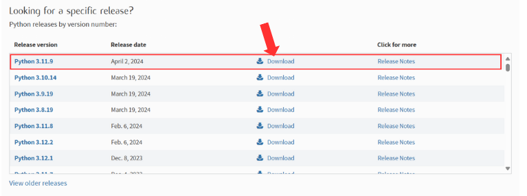
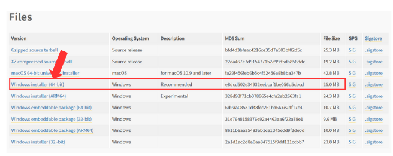

# Reconnaissance de la langue des signes

Ce projet propose une implémentation de la reconnaissance de la langue des signes en testant un modèle SVM (Support Vector Machine) et un réseau de neurone classique. Des cas d'application ont aussi été réalisés et sont accessibles dans le dossier "Application". Cela comprend une détection en direct de la langue ainsi qu'une interface dictionnaire.

## Installations

Pour tester ce projet, vous aurez besoin d'installer la version 3.11.9 de Python. Vous pouvez le télécharger depuis les sites officiels de [Python](https://www.python.org/downloads/). Pour procéder à l'installation, suivez les instructions suivantes.

### Installation de Python 3.11.9
1. Rendez-vous sur le site de [Python](https://www.python.org/downloads/) et cherchez la version 3.11.9 puis cliquez sur Download.

 

2. Choississez la version correspondantes à votre système d'exploitation.

 

3. Cochez l'option Add python.exe to PATH puis séletionnez Install Now.

 

4. Fermez la fenêtre de téléchargement et retournez sur le [Notebook](./NoteBook.ipynb) du projet.

### Mise à jour du kernel

1. Une fois sur le Notebook, Cliquez sur la version actuelle du kernel en haut à droite.

 

2. Sélectionnez "Select Another Kernel".

 

3. Sélectionnez "Python Environments".

 

4. Et choississez la version 3.11.9 qui vient d'être téléchargée.

### Exécution du code

Une fois que vous avez installé Python et modifié le kernel, vous pouvez exécuter le code à partir de votre éditeur de code.
Je recommande fortement d'explorer le [Notebook](./NoteBook.ipynb) en priorité car il reprend l'ensemble des travaux qui ont été réalisés dans les dossiers [DataManipulation](./DataManipulation/),  [MediaPipe](./MediaPipe/) et [Models](./Models/).

Une fois l'**intégralité** du NoteBook éxecuté, il est possible de tester les [cas d'application](./Application/) réalisés qui comporte une [détection en direct](./Application/Direct/CaptureVideo.py) ainsi qu'une [interface dictionnaire](./Application/Interface/interface.py).

### Auteurs

Ce projet a été développé par Lucie Della-Negra dans le cadre d'un projet scolaire individuel informatique à l'ENSC (Ecole Nationale Supérieure de Cognitique).